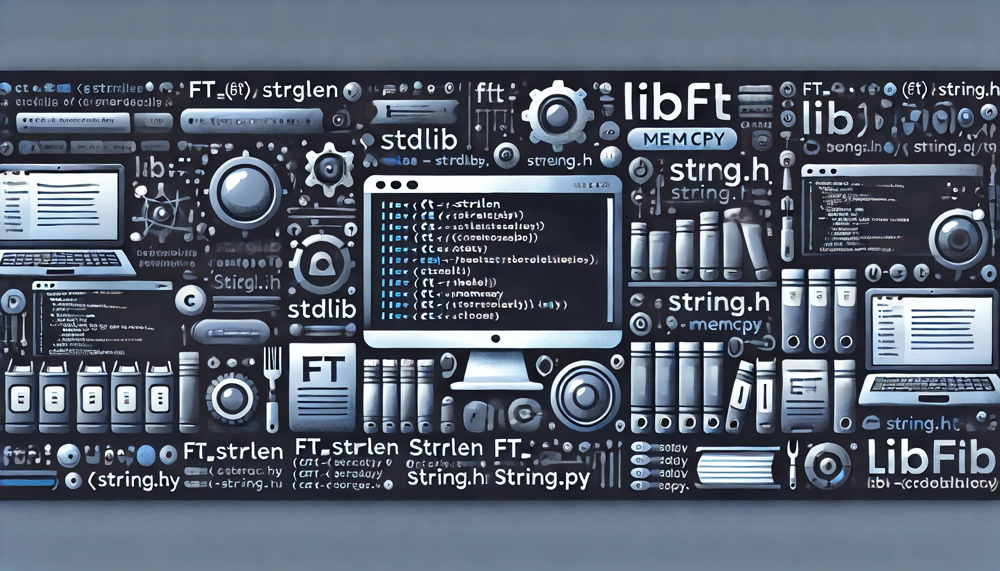

## Projet : libft

Premier projet de l'école 42, il a pour objectif la création d'une bibliothèque de fonctions. Ces fonctions seront utilisées dans les projets suivants."

## Notions
- Algorithmes : Comprendre et implémenter des algorithmes de base.
- Apprentissage du langage C : Maîtriser les bases du langage de programmation C.
- Gestion de la mémoire : Utiliser correctement la mémoire dynamique.
- Manipulation de chaînes : Travailler avec des chaînes de caractères.
- Fonctions de bibliothèque : Créer des fonctions réutilisables pour des opérations courantes.
## Language
- C